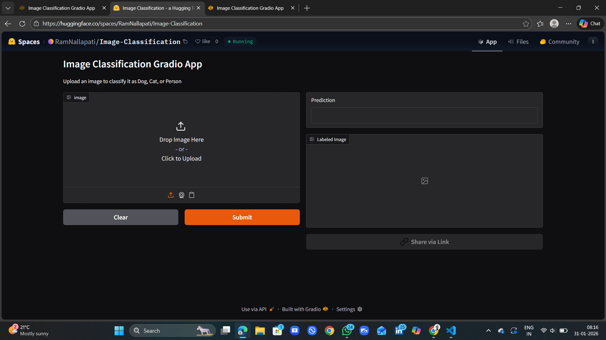

# Image Classification Application Using PyTorch
## Deep Learning-based image classification using CNN, PyTorch & Gradio

[Live Demo](https://huggingface.co/spaces/RamNallapati/Image-Classification)

[Github Repo](https://github.com/ramnallapati/Image-Classification-App-Using-Pytorch/tree/main)

---

## Table of Contents

- [Overview](#overview)
- [Key Features](#key-features)
- [Quick Start](#quick-start)
- [Installation](#installation)
- [Usage](#usage)
- [Configuration](#configuration)
- [API Documentation](#api-documentation)
- [Examples](#examples)
- [Architecture](#architecture)
- [Contributing](#contributing)
- [Testing](#testing)
- [Deployment](#deployment)
- [FAQ](#faq)
- [Changelog](#changelog)
- [Roadmmap](#roadmap)
- [License](#license)
- [Acknowledgements](#acknowledgements)
- [Support](#support)

---

# Overview

**Image Classification Application** is a used to Predict the Images Dogs Cats Person. Built with PyTorch Computer Vision. It detect the Images.

### Why This Project ?

- **Problem** : Manually identifying whether an image contains a dog, cat, or human is inefficient and unreliable, especially at scale
- **Solution** : This project uses a PyTorch-based deep learning model with a Gradio interface to automatically classify images into dogs, cats, or humans in real time.
- **Impact** : It enables fast, accurate, and user-friendly image classification, making AI-based visual recognition accessible to everyone.

### Who Is This For ?
- Developers looking to learn and implement image classification using PyTorch
- Teams needing a simple and deployable AI solution for basic image categorization
- Anyone who wants to quickly identify whether an image contains a dog, cat, or human using an easy web interface

---

## Key Features

<table>
<tr>
<td width="50%">

### Performance
- Lightning-fast response time
- Optimized for high accurac
</td>

<td width='50%'>

### Security
- No Security is Provided
- It is a free application
</td>
</tr>

<tr>
<td width='50%'>

### Developer Experience
- Easy to Deploy
- Support any type of image formats
</td>
<td width='50%'>

### Scalability

- Support any type of image
- It support blur Images also
</td>
</tr>
</table>

---